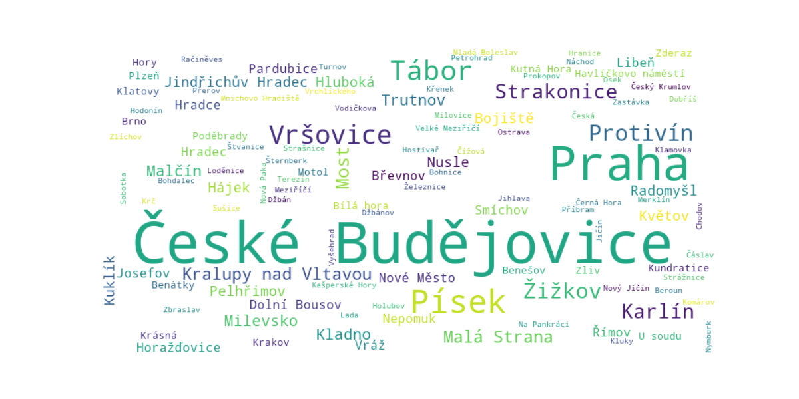

### Identifying geographic references in Czech texts

This is a data analysis/NLP project. The goal is to identify and classify geographic references in Jaroslav Hašek's classic novel *Osudy dobrého vojáka Švejka za světové války*.

### Challenge
Like most Slavic languages, Czech has a complex system of declensions (*skloňováni*) that makes a direct string-matching approach to identifying word-forms unfeasible. Furthermore, there are additional complicating factors both in the form of some phonological features of Czech, such as Havlik's law of vowel reductions (e.g. *Pisek*, but *v Pisku*) or consonant alterations (e.g. *Praha*, but *v Praze*), and existence of a rich regional onomastic tradition, when some Czech toponyms reach 5-7 words in length while featuring chained locatives (e.g. *Vícenice u Náměště nad Oslavou* or *Nová Ves u Nového Města na Moravě*).

### Approach
We lemmatize the text and the dictionary entries (here, a toponyms list) retaining triples of the from (lemma, grammatic gender, number); the latter two entries can be void. The Aho-Corasick algorithm is then applied to search for the transformed dictionary entries in the transformed text. Lemmatization is carried out by means of the UDPipe library (https://lindat.mff.cuni.cz/services/udpipe/) with the UD 2.5 Czech language model (the model manages to tokenize some terms as geographic locations, but not consistently). 

### Data
We opted not to use larger databases of named entities or geographic locations such as GeoNames. The toponyms base that we use is limited to the municipalities names within present-day Czech Republic and Prague districts. Streets and public places are not included. The data is collected from the open-access datasets provided by the *Český statistický úřad* (https://csu.gov.cz/). 

### Workflow

The project is organized as a set of Jupyter notebooks.

- `get_geo_base.ipnyb` is a data scraping and cleaning script. The outcome is a toponyms base as a CSV datasheet.
- `get_text.ipnyb` fetches the novel text (it is in the public domain, but we could not find a readily-available single-file version thereof).
- `svejk-geo.ipnyb` runs the Aho-Corasick algorithm upon lemmatization. The found matches with exact references within the text are saved in a JSON file.

`ufal.udpipe` can be pip-installed. The UD 2.5 model for Czech that we use can be downloaded from http://hdl.handle.net/11234/1-3131 .

### Customization

We tried to keep the setup robust. Aside from some context- and task-dependent details, the core can be adapted to other datasets.

### Results

455 references to 115 locations have been identified. There are some false positives, and some actual references are missed. This is a drawback of the lemmatization approach (e.g. lemmatizing separately the village name *Mydlovary* in the toponyms base and its grammatic forms in the text does not lead to a match). Possibly, the situation is better with the state-of-the-art models trained on UD 2.15 (http://hdl.handle.net/11234/1-5797), but we have not tried it.

### Further development

A simpler approach to try, that does not involve lemmatization at all, is something like a "fuzzy prefix tree", where a prefix tree is kept being traversed if the edit distance (or some other related numerical characteristic) between the source and a pattern does not exceed a certain threshold. 